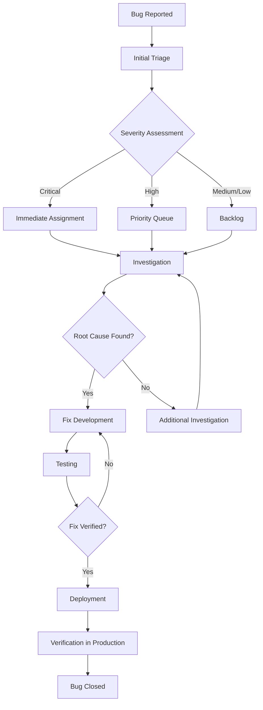

# Mobile QA Guide

## Overview

This comprehensive guide provides Quality Assurance (QA) procedures, testing protocols, and validation criteria for the mobile frontend implementation. It covers manual testing, automated testing, accessibility validation, and device-specific testing requirements.

## Table of Contents

1. [QA Framework Overview](#qa-framework-overview)
2. [Mobile Testing Strategy](#mobile-testing-strategy)
3. [Device Testing Matrix](#device-testing-matrix)
4. [Manual Testing Procedures](#manual-testing-procedures)
5. [Automated Testing Guidelines](#automated-testing-guidelines)
6. [Accessibility Testing](#accessibility-testing)
7. [Performance Testing](#performance-testing)
8. [Cross-Browser Compatibility](#cross-browser-compatibility)
9. [User Experience Validation](#user-experience-validation)
10. [Bug Reporting and Tracking](#bug-reporting-and-tracking)
11. [Release Validation](#release-validation)

## QA Framework Overview

### Testing Philosophy

- **Progressive Enhancement**: Ensure core functionality works on all devices
- **Touch-First Validation**: Verify all interactions work properly with touch
- **Accessibility First**: WCAG 2.1 AA compliance on all features
- **Performance Critical**: Load times under 3 seconds on 3G networks
- **Cross-Platform Consistency**: Consistent behavior across devices and browsers

### Quality Gates

| Gate | Criteria | Required Tests |
|------|----------|----------------|
| Development | Component-level validation | Unit tests, Component tests |
| Integration | Feature workflow validation | Integration tests, E2E tests |
| Staging | Cross-device validation | Device emulation, Manual testing |
| Pre-Production | Performance validation | Load tests, Accessibility audits |
| Production | Monitoring validation | Real user monitoring, Error tracking |

## Mobile Testing Strategy

### Test Pyramid for Mobile

```
    Manual Exploratory Testing (5%)
           ↑
    Cross-Device Testing (10%)
           ↑
    Integration Tests (25%)
           ↑
    Unit Tests (60%)
```

### Testing Levels

1. **Unit Tests** (60% of tests)
   - Component rendering
   - Event handling
   - State management
   - Utility functions

2. **Integration Tests** (25% of tests)
   - User workflows
   - API interactions
   - Component interactions
   - Navigation flows

3. **Cross-Device Tests** (10% of tests)
   - Device-specific behavior
   - Orientation changes
   - Touch interactions
   - Performance across devices

4. **Manual Exploratory** (5% of tests)
   - User experience validation
   - Edge case discovery
   - Accessibility validation
   - Real-world usage scenarios

## Device Testing Matrix

### Primary Test Devices

| Device Category | Models | OS Versions | Browsers |
|----------------|--------|-------------|----------|
| **iPhone** | iPhone 12, 13, 14, 15 | iOS 15-17 | Safari, Chrome |
| **Android** | Samsung Galaxy S21-S24, Pixel 6-8 | Android 11-14 | Chrome, Samsung Browser |
| **Tablet** | iPad Air, iPad Pro, Samsung Tab | iOS 15+, Android 11+ | Safari, Chrome |
| **Budget Devices** | iPhone SE, Samsung A-series | iOS 15+, Android 10+ | Safari, Chrome |

### Secondary Test Devices

| Device Category | Models | Priority | Notes |
|----------------|--------|----------|--------|
| **Older iOS** | iPhone X, 11 | Medium | Legacy support validation |
| **Budget Android** | Motorola, OnePlus | Medium | Performance validation |
| **Foldables** | Galaxy Fold, Pixel Fold | Low | Future compatibility |

### Browser Matrix

| Browser | Mobile Support | Testing Priority | Notes |
|---------|----------------|------------------|--------|
| **Safari iOS** | iOS 15+ | High | Primary iOS browser |
| **Chrome Mobile** | Android 10+ | High | Primary Android browser |
| **Samsung Browser** | Android 10+ | Medium | Popular on Samsung devices |
| **Firefox Mobile** | Android 10+ | Low | Limited market share |

## Manual Testing Procedures

### Pre-Testing Setup

```bash
# Device preparation checklist
1. Clear browser cache and cookies
2. Ensure stable network connection
3. Update to latest OS version
4. Install latest browser versions
5. Enable accessibility features (when testing)
6. Disable auto-brightness
7. Set standard font sizes
```

### Core Functionality Testing

#### 1. Navigation Testing

**Test Case: Mobile Navigation**
```
Objective: Verify mobile navigation works correctly
Preconditions: Mobile device, authenticated user

Steps:
1. Open mobile application
2. Tap hamburger menu icon
3. Verify drawer opens smoothly
4. Tap on each navigation item
5. Verify page transitions
6. Test back button functionality
7. Test deep linking

Expected Results:
- Navigation drawer opens/closes smoothly
- All menu items are accessible
- Page transitions are smooth (< 300ms)
- Back button works correctly
- Deep links resolve properly

Pass/Fail Criteria:
- All navigation items functional
- No lag or stuttering
- Proper visual feedback
```

#### 2. Touch Interaction Testing

**Test Case: Swipe Gestures**
```
Objective: Verify swipe gestures work correctly
Preconditions: Mobile device, swipeable components visible

Steps:
1. Navigate to page with swipeable cards
2. Perform left swipe on card
3. Verify action appears
4. Perform right swipe on card
5. Verify action appears
6. Test swipe velocity variations
7. Test partial swipes
8. Test swipe cancellation

Expected Results:
- Actions appear smoothly
- Proper haptic feedback (if supported)
- Visual feedback during swipe
- Consistent behavior across cards

Pass/Fail Criteria:
- Swipe threshold consistent (80px)
- Actions trigger reliably
- No false positives
```

#### 3. Form Input Testing

**Test Case: Mobile Form Interactions**
```
Objective: Verify forms work correctly on mobile
Preconditions: Mobile device, form page loaded

Steps:
1. Tap on text input field
2. Verify virtual keyboard appears
3. Enter text in all field types
4. Test field validation
5. Test form submission
6. Test auto-complete features
7. Test field navigation

Expected Results:
- Keyboard appears without layout shift
- All field types work correctly
- Validation messages clear
- Submission successful

Pass/Fail Criteria:
- No layout issues with keyboard
- All inputs accessible
- Validation works correctly
```

### Accessibility Testing Procedures

#### 1. Screen Reader Testing

**iOS VoiceOver Testing**
```
Setup:
1. Settings > Accessibility > VoiceOver > On
2. Practice basic gestures
3. Ensure audio is enabled

Test Procedure:
1. Navigate through app using swipe gestures
2. Verify all elements are announced
3. Test custom actions
4. Verify reading order
5. Test form interactions
6. Test modal/dialog interactions

Validation Criteria:
- All interactive elements have labels
- Reading order is logical
- Actions are clearly announced
- No irrelevant content announced
```

**Android TalkBack Testing**
```
Setup:
1. Settings > Accessibility > TalkBack > On
2. Enable explore by touch
3. Practice basic gestures

Test Procedure:
1. Use explore by touch navigation
2. Test double-tap activation
3. Verify element descriptions
4. Test scrolling announcements
5. Test heading navigation
6. Test landmark navigation

Validation Criteria:
- All content accessible
- Proper heading structure
- Meaningful descriptions
- Logical navigation
```

#### 2. Touch Target Testing

**Test Case: Touch Target Sizes**
```
Objective: Verify all touch targets meet minimum size requirements
Preconditions: Mobile device, measurement tool

Steps:
1. Open developer tools
2. Measure all interactive elements
3. Verify minimum 44x44px size
4. Test tap accuracy
5. Test with different finger sizes
6. Verify spacing between targets

Expected Results:
- All targets ≥ 44x44px
- Sufficient spacing (8px minimum)
- No accidental activations

Pass/Fail Criteria:
- WCAG 2.1 AA compliance
- User testing validates ease of use
```

### Performance Testing Procedures

#### 1. Load Time Testing

**Test Case: Page Load Performance**
```
Objective: Verify pages load within acceptable time limits
Preconditions: Mobile device, network throttling tools

Test Conditions:
- WiFi (Fast)
- 4G (Regular)
- 3G (Slow)
- Slow 3G (Edge case)

Steps for each condition:
1. Clear browser cache
2. Navigate to page
3. Measure time to interactive
4. Measure first contentful paint
5. Measure largest contentful paint
6. Record any errors

Acceptance Criteria:
- WiFi: < 1 second
- 4G: < 2 seconds
- 3G: < 3 seconds
- Slow 3G: < 5 seconds
```

#### 2. Memory Usage Testing

**Test Case: Memory Consumption**
```
Objective: Verify app doesn't consume excessive memory
Preconditions: Mobile device, dev tools access

Steps:
1. Open browser dev tools
2. Monitor memory usage
3. Navigate through app
4. Perform typical user actions
5. Monitor for memory leaks
6. Test intensive operations

Acceptance Criteria:
- Memory usage < 100MB for typical workflows
- No memory leaks detected
- Graceful handling of low memory
```

### Regression Testing

#### Critical Path Testing

**Daily Smoke Tests**
```
1. Login flow
2. Dashboard navigation
3. Primary feature access
4. Form submission
5. Data display
6. Logout flow

Time: 15 minutes
Frequency: Every build
```

**Weekly Regression Suite**
```
1. All navigation paths
2. All form interactions
3. Error handling
4. Offline scenarios
5. Performance benchmarks
6. Accessibility audit

Time: 2 hours
Frequency: Weekly
```

## Automated Testing Guidelines

### Test Automation Setup

```bash
# Install dependencies
npm install --save-dev @playwright/test
npm install --save-dev axe-playwright

# Configure Playwright for mobile
# playwright.config.ts
export default {
  projects: [
    {
      name: 'Mobile Chrome',
      use: { ...devices['Pixel 5'] },
    },
    {
      name: 'Mobile Safari',
      use: { ...devices['iPhone 12'] },
    },
  ],
};
```

### Automated Test Examples

#### 1. Cross-Device Component Test

```typescript
// tests/mobile/cross-device.spec.ts
import { test, expect, devices } from '@playwright/test';

const mobileDevices = [
  'iPhone 12',
  'Pixel 5',
  'iPad Pro',
  'Samsung Galaxy S21'
];

mobileDevices.forEach(deviceName => {
  test.describe(`${deviceName} - Component Tests`, () => {
    test.use(devices[deviceName]);

    test('should render mobile layout correctly', async ({ page }) => {
      await page.goto('/mobile/dashboard');
      
      // Verify mobile layout is active
      await expect(page.locator('[data-testid="mobile-layout"]')).toBeVisible();
      
      // Verify responsive behavior
      const viewport = page.viewportSize();
      expect(viewport.width).toBeLessThan(768);
    });

    test('should handle touch interactions', async ({ page }) => {
      await page.goto('/mobile/dashboard');
      
      // Test swipe gesture
      const card = page.locator('[data-testid="swipeable-card"]').first();
      await card.hover();
      await page.mouse.down();
      await page.mouse.move(card.boundingBox().x + 100, card.boundingBox().y);
      await page.mouse.up();
      
      // Verify action appeared
      await expect(page.locator('[data-testid="swipe-action"]')).toBeVisible();
    });
  });
});
```

#### 2. Accessibility Automation

```typescript
// tests/mobile/accessibility.spec.ts
import { test, expect } from '@playwright/test';
import { injectAxe, checkA11y } from 'axe-playwright';

test.describe('Mobile Accessibility', () => {
  test.beforeEach(async ({ page }) => {
    await page.goto('/mobile/dashboard');
    await injectAxe(page);
  });

  test('should pass WCAG 2.1 AA standards', async ({ page }) => {
    await checkA11y(page, null, {
      detailedReport: true,
      detailedReportOptions: { html: true },
    });
  });

  test('should have proper heading structure', async ({ page }) => {
    const headings = await page.locator('h1, h2, h3, h4, h5, h6').all();
    
    // Verify logical heading order
    for (let i = 0; i < headings.length - 1; i++) {
      const currentLevel = parseInt(await headings[i].tagName().then(tag => tag.charAt(1)));
      const nextLevel = parseInt(await headings[i + 1].tagName().then(tag => tag.charAt(1)));
      
      expect(nextLevel).toBeLessThanOrEqual(currentLevel + 1);
    }
  });

  test('should have sufficient color contrast', async ({ page }) => {
    await checkA11y(page, null, {
      rules: {
        'color-contrast': { enabled: true }
      }
    });
  });
});
```

#### 3. Performance Automation

```typescript
// tests/mobile/performance.spec.ts
import { test, expect } from '@playwright/test';

test.describe('Mobile Performance', () => {
  test('should load pages within performance budget', async ({ page }) => {
    // Start tracing
    await page.tracing.start({ screenshots: true, snapshots: true });
    
    const startTime = Date.now();
    await page.goto('/mobile/dashboard');
    
    // Wait for page to be interactive
    await page.waitForLoadState('networkidle');
    const loadTime = Date.now() - startTime;
    
    // Stop tracing
    await page.tracing.stop({ path: 'trace.zip' });
    
    // Verify performance budget
    expect(loadTime).toBeLessThan(3000); // 3 seconds max
    
    // Check Core Web Vitals
    const vitals = await page.evaluate(() => {
      return new Promise((resolve) => {
        new PerformanceObserver((list) => {
          const entries = list.getEntries();
          resolve(entries.map(entry => ({
            name: entry.name,
            value: entry.value
          })));
        }).observe({ entryTypes: ['measure'] });
      });
    });
    
    // Verify LCP < 2.5s
    const lcp = vitals.find(v => v.name === 'LCP');
    if (lcp) {
      expect(lcp.value).toBeLessThan(2500);
    }
  });
});
```

## Bug Reporting and Tracking

### Bug Report Template

```markdown
## Mobile Bug Report

**Bug ID**: MOB-YYYY-NNNN
**Date**: YYYY-MM-DD
**Reporter**: [Name]
**Priority**: [Critical/High/Medium/Low]

### Environment
- **Device**: [iPhone 14, Samsung Galaxy S23, etc.]
- **OS**: [iOS 16.5, Android 13, etc.]
- **Browser**: [Safari 16.5, Chrome 115, etc.]
- **App Version**: [1.6.x]
- **Network**: [WiFi/4G/3G]

### Bug Description
[Clear, concise description of the issue]

### Steps to Reproduce
1. [First step]
2. [Second step]
3. [Third step]

### Expected Behavior
[What should happen]

### Actual Behavior
[What actually happens]

### Impact Assessment
- **User Impact**: [How many users affected]
- **Business Impact**: [Revenue/functionality impact]
- **Workaround Available**: [Yes/No - describe if yes]

### Evidence
- **Screenshots**: [Attach relevant screenshots]
- **Video**: [Screen recording if needed]
- **Console Logs**: [Any error messages]
- **Network Logs**: [If network-related]

### Additional Context
[Any other relevant information]
```

### Bug Classification

| Priority | Description | Response Time |
|----------|-------------|---------------|
| **Critical** | App crashes, data loss, security issues | 2 hours |
| **High** | Core functionality broken, major UX issues | 24 hours |
| **Medium** | Feature partially working, minor UX issues | 72 hours |
| **Low** | Cosmetic issues, enhancement requests | 1 week |

### Bug Tracking Workflow



## Release Validation

### Pre-Release Checklist

#### 1. Functional Validation
- [ ] All critical user journeys work
- [ ] All forms submit correctly
- [ ] Navigation functions properly
- [ ] Authentication works
- [ ] Error handling functions
- [ ] Offline scenarios handled

#### 2. Performance Validation
- [ ] Page load times within budget
- [ ] Memory usage acceptable
- [ ] Battery usage reasonable
- [ ] Network efficiency optimized
- [ ] Bundle size within limits

#### 3. Accessibility Validation
- [ ] WCAG 2.1 AA compliance verified
- [ ] Screen reader compatibility tested
- [ ] Keyboard navigation works
- [ ] Color contrast sufficient
- [ ] Touch targets adequate

#### 4. Device Compatibility
- [ ] Primary devices tested
- [ ] Secondary devices sampled
- [ ] Orientation changes work
- [ ] Different screen sizes supported
- [ ] Various network conditions tested

#### 5. Security Validation
- [ ] Authentication secure
- [ ] Data transmission encrypted
- [ ] No sensitive data in logs
- [ ] Input validation working
- [ ] XSS protection active

### Post-Release Monitoring

#### 1. Real User Monitoring
```javascript
// Performance monitoring
const observer = new PerformanceObserver((list) => {
  list.getEntries().forEach((entry) => {
    if (entry.entryType === 'navigation') {
      // Track page load metrics
      analytics.track('page_load', {
        url: entry.name,
        loadTime: entry.loadEventEnd - entry.loadEventStart,
        device: navigator.userAgent
      });
    }
  });
});
observer.observe({ entryTypes: ['navigation'] });
```

#### 2. Error Tracking
```javascript
// Error monitoring
window.addEventListener('error', (event) => {
  errorTracking.capture({
    message: event.message,
    stack: event.error?.stack,
    url: window.location.href,
    userAgent: navigator.userAgent,
    timestamp: new Date().toISOString()
  });
});
```

#### 3. Usage Analytics
```javascript
// User interaction tracking
document.addEventListener('touchstart', (event) => {
  analytics.track('touch_interaction', {
    target: event.target.tagName,
    timestamp: Date.now(),
    coordinates: {
      x: event.touches[0].clientX,
      y: event.touches[0].clientY
    }
  });
});
```

### Success Metrics

| Metric | Target | Measurement |
|--------|--------|-------------|
| **Page Load Time** | < 3s on 3G | Real User Monitoring |
| **Error Rate** | < 0.1% | Error tracking |
| **Accessibility Score** | 100% WCAG AA | Automated audits |
| **User Satisfaction** | > 4.5/5 | User feedback |
| **Performance Score** | > 90 | Lighthouse CI |
| **Memory Usage** | < 100MB | Browser profiling |

## Continuous Improvement

### QA Metrics Dashboard

Track and monitor:
- Test execution rates
- Bug discovery rates
- Performance trends
- Accessibility compliance
- User satisfaction scores
- Device compatibility coverage

### Regular QA Reviews

- **Weekly**: Test result analysis
- **Monthly**: Process improvements
- **Quarterly**: Tool evaluation
- **Annually**: Strategy review

This comprehensive QA guide ensures high-quality mobile experiences across all devices and use cases. Regular updates to testing procedures and tools keep pace with the evolving mobile landscape.